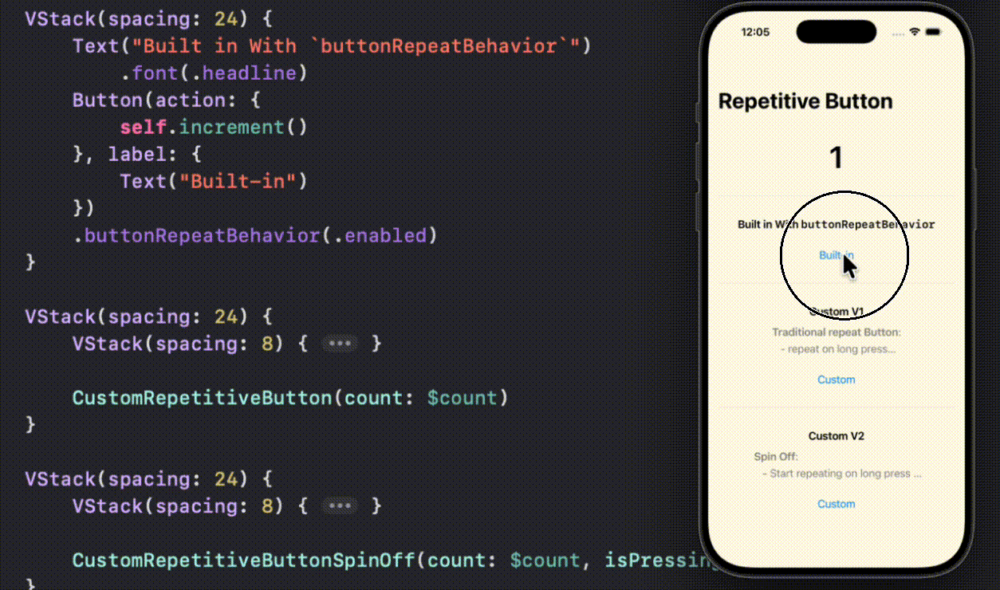

# SwiftUI_RepetitiveButton

A demo of implementing Repetitive Button.

- built-in with `buttonRepeatBehavior`
- custom with control on repeat delay and increment speed
- spin-off
  - Start repeating on long press without keep holding down
  - Stop repeating on tap outside

For more details, please refer to my article [SwiftUI: Repetitive Button 2.5 ways. Built-in & Custom.]()

